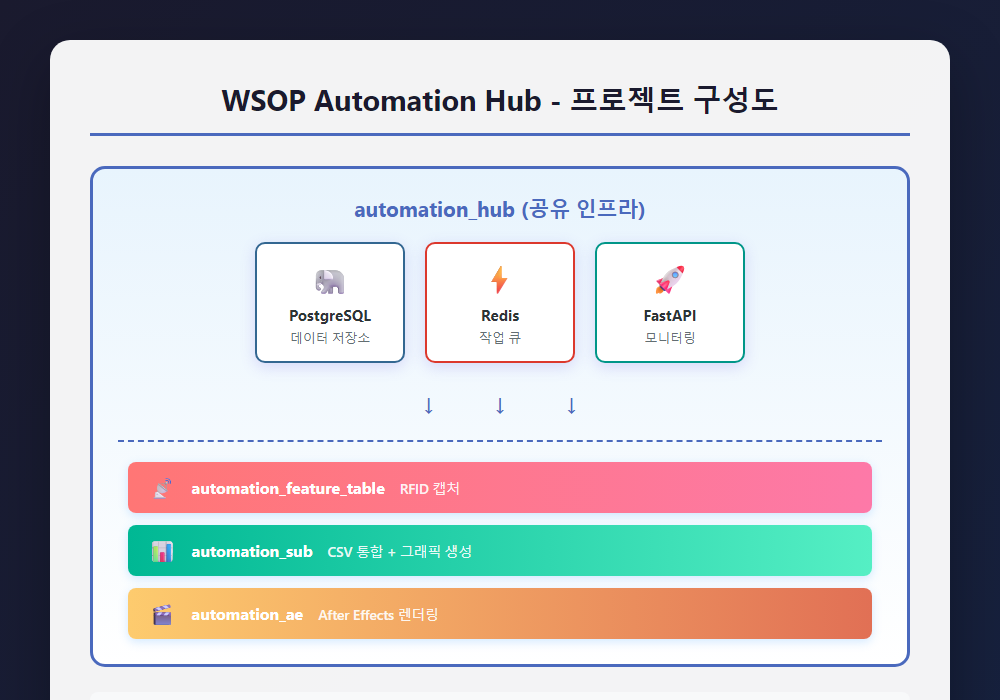
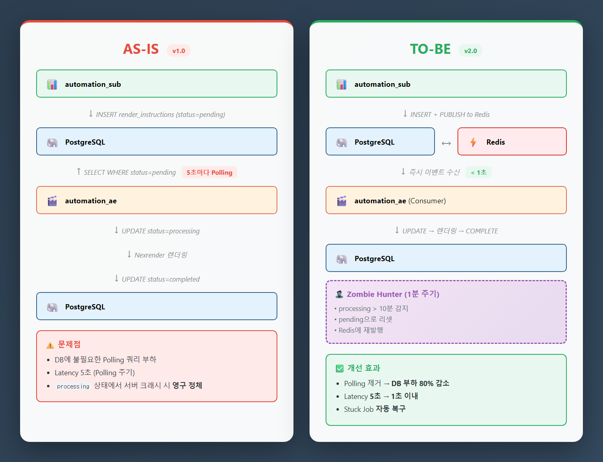
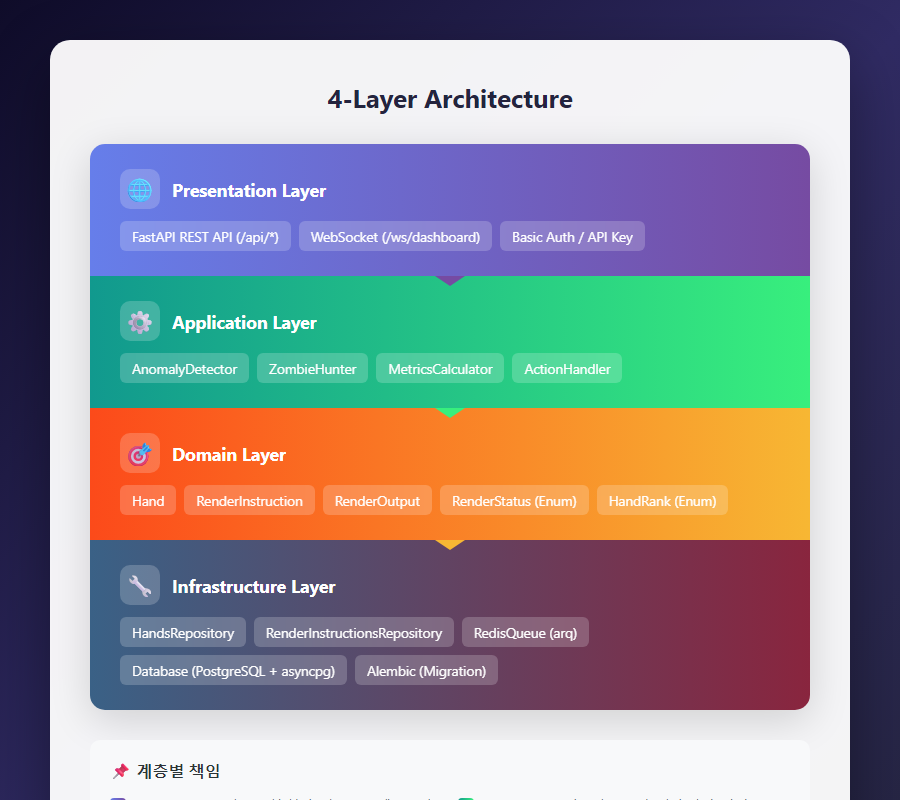
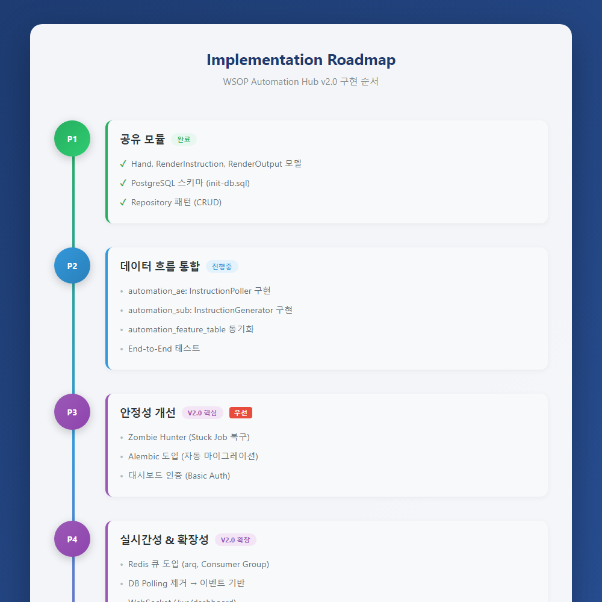

# PRD-0001: WSOP Automation Hub v2.0

## 문서 정보

| 항목 | 내용 |
|------|------|
| **PRD ID** | PRD-0001 |
| **제목** | WSOP Automation Hub v2.0 (Reliability & Real-time Update) |
| **이전 버전** | [PRD-0000](./archive/PRD-0000-automation-hub-integration.md) |
| **버전** | 2.0.1 |
| **작성일** | 2025-12-26 |
| **수정일** | 2026-01-05 |
| **상태** | Draft |

---

## Executive Summary

**automation_hub**는 WSOP 방송 자동화를 위한 3개 프로젝트(feature_table, sub, ae)의 공유 인프라입니다.

### v1.0 현황
- 공유 DB 패턴으로 데이터 일관성 확보
- Pydantic v2 + Repository 패턴으로 코드 품질 유지
- **단, DB Polling 방식으로 인한 Latency 및 Stuck Job 문제 존재**

### v2.0 목표
| 목표 | 현재 | 목표 |
|------|------|------|
| 작업 분배 Latency | 5초 (Polling) | < 1초 (Redis) |
| Stuck Job 복구율 | 0% | > 85% |
| 실시간 모니터링 | 새로고침 필요 | WebSocket |
| 스키마 마이그레이션 | 수동 (init-db.sql) | 자동 (Alembic) |

---

## 1. 문제 정의 & 배경

### 1.1 프로젝트 구성



> 📎 **HTML 원본**: [prd-0001-project-structure.html](../../docs/mockups/prd-0001-project-structure.html)

<details>
<summary>📝 텍스트 다이어그램 (접기/펼치기)</summary>

```
┌─────────────────────────────────────────────────────────────┐
│                    automation_hub (공유 인프라)              │
│  ┌─────────────┐  ┌─────────────┐  ┌─────────────┐         │
│  │ PostgreSQL  │  │   Redis     │  │  FastAPI    │         │
│  │ (데이터)    │  │ (작업 큐)   │  │ (모니터링)  │         │
│  └──────┬──────┘  └──────┬──────┘  └──────┬──────┘         │
│         │                │                │                 │
├─────────┼────────────────┼────────────────┼─────────────────┤
│         ↓                ↓                ↓                 │
│  automation_feature_table (RFID 캡처)                       │
│  automation_sub (CSV 통합 + 그래픽 생성)                    │
│  automation_ae (After Effects 렌더링)                       │
└─────────────────────────────────────────────────────────────┘
```

</details>

### 1.2 현재 문제점 (v1.0)

| # | 문제 | 영향 | 심각도 |
|---|------|------|--------|
| 1 | **DB Polling 방식** | 5초 지연, DB 부하 증가, 확장성 제한 | 높음 |
| 2 | **Stuck Job 미처리** | 서버 크래시 시 작업 영구 정체 | 높음 |
| 3 | **수동 마이그레이션** | 스키마 변경 시 데이터 손실 위험 | 중간 |
| 4 | **인증 부재** | 대시보드 무단 접근 가능 | 중간 |
| 5 | **실시간성 부재** | 새로고침 의존적 상태 확인 | 낮음 |

### 1.3 v1.0 장점 (유지)

| # | 장점 | 설명 |
|---|------|------|
| 1 | **관심사 분리** | `shared` 패키지로 3개 서비스 DTO/DB 로직 공유 |
| 2 | **비동기 최적화** | async/await + asyncpg + SQLAlchemy AsyncSession |
| 3 | **타입 안전성** | Pydantic v2 + Repository 패턴 |
| 4 | **컨테이너화** | docker-compose 기반 배포 |

---

## 2. 목표 & 성공 지표

### 2.1 핵심 목표

| # | 목표 | 상세 |
|---|------|------|
| 1 | **Latency 감소** | 렌더링 지시 → 작업 시작: 5초 → 1초 이내 |
| 2 | **안정성 확보** | 서버 장애 시 작업 자동 복구 (Stuck Job 해결) |
| 3 | **운영 효율화** | 실시간 대시보드 + 스키마 자동 마이그레이션 |
| 4 | **보안 강화** | 대시보드 인증 필수화 |

### 2.2 성공 지표

| 지표 | 현재 (v1.0) | 목표 (v2.0) |
|------|-------------|-------------|
| 작업 분배 Latency | 5초 | < 1초 |
| Stuck Job 복구율 | 0% | > 85% |
| 작업 유실률 | 측정 불가 | 0% |
| 모니터링 API 응답 | N/A | < 200ms |
| 수평 확장 | 불가 (중복 할당) | 지원 (Consumer Group) |
| 대시보드 실시간성 | 새로고침 필요 | WebSocket 즉시 반영 |

---

## 3. 아키텍처

### 3.1 AS-IS vs TO-BE 아키텍처 비교



> 📎 **HTML 원본**: [prd-0001-as-is-to-be.html](../../docs/mockups/prd-0001-as-is-to-be.html)

<details>
<summary>📝 텍스트 다이어그램 (접기/펼치기)</summary>

#### AS-IS (v1.0)

```
automation_sub
    ↓ INSERT render_instructions (status=pending)
PostgreSQL
    ↑ SELECT WHERE status=pending (5초마다 Polling)
automation_ae
    ↓ UPDATE status=processing
    ↓ Nexrender 렌더링
    ↓ UPDATE status=completed
PostgreSQL
```

**문제점**:
- DB에 불필요한 Polling 쿼리 부하
- Latency 5초 (Polling 주기)
- `processing` 상태에서 서버 크래시 시 영구 정체

#### TO-BE (v2.0)

```
automation_sub
    ↓ INSERT render_instructions + PUBLISH to Redis
PostgreSQL ←──────────────────→ Redis (Stream/Queue)
                                    ↓ 즉시 이벤트 수신
                               automation_ae (Consumer)
                                    ↓ UPDATE status=processing
                                    ↓ Nexrender 렌더링
                                    ↓ UPDATE status=completed
                               ┌────────────────────────────┐
                               │ Zombie Hunter (1분 주기)   │
                               │ - processing > 10분 감지   │
                               │ - pending으로 리셋         │
                               │ - Redis에 재발행          │
                               └────────────────────────────┘
```

**개선 효과**:
- Polling 제거 → DB 부하 80% 감소
- Latency 5초 → 1초 이내
- Stuck Job 자동 복구

</details>

### 3.2 계층 구조 (4-Layer Architecture)



> 📎 **HTML 원본**: [prd-0001-layer-architecture.html](../../docs/mockups/prd-0001-layer-architecture.html)

<details>
<summary>📝 텍스트 다이어그램 (접기/펼치기)</summary>

```
┌─────────────────────────────────────────────────────────────┐
│   Presentation Layer                                         │
│   - FastAPI REST API (/api/*)                               │
│   - WebSocket (/ws/dashboard)                               │
│   - Basic Auth / API Key                                    │
├─────────────────────────────────────────────────────────────┤
│   Application Layer                                          │
│   - AnomalyDetector (이상 감지)                              │
│   - ZombieHunter (Stuck Job 복구)                           │
│   - MetricsCalculator (메트릭 계산)                          │
│   - ActionHandler (관리자 개입 처리)                         │
├─────────────────────────────────────────────────────────────┤
│   Domain Layer                                               │
│   - Hand, RenderInstruction, RenderOutput (Pydantic)        │
│   - RenderStatus, HandRank (Enum)                           │
├─────────────────────────────────────────────────────────────┤
│   Infrastructure Layer                                       │
│   - HandsRepository, RenderInstructionsRepository           │
│   - RedisQueue (arq)                                        │
│   - Database (PostgreSQL + asyncpg)                         │
│   - Alembic (Migration)                                      │
└─────────────────────────────────────────────────────────────┘
```

</details>

---

## 4. 기능 요구사항

### 4.1 데이터 모델 (유지)

#### Hand (포커 핸드)
```python
Hand:
  id: int (PK)
  table_id: str
  hand_number: int
  source: SourceType (RFID | CSV | MANUAL)
  hand_rank: HandRank
  pot_size: int
  winner: str
  players: list[PlayerInfo]
  community_cards: list[str]
  is_premium: bool (property)  # Royal Flush 이상
  created_at: datetime
```

#### RenderInstruction (렌더링 작업)
```python
RenderInstruction:
  id: int (PK)
  template_name: str
  layer_data: dict
  output_settings: OutputSettings
  status: RenderStatus (PENDING | PROCESSING | COMPLETED | FAILED | STALE)
  priority: int (1=최고, 10=최저)
  trigger_type: str
  trigger_id: str
  retry_count: int
  max_retries: int (default=3)
  error_message: Optional[str]
  created_at, started_at, completed_at: datetime
```

#### RenderOutput (렌더링 결과)
```python
RenderOutput:
  id: int (PK)
  instruction_id: int (FK)
  output_path: str
  file_size: int
  frame_count: Optional[int]
  status: RenderStatus
  error_message: Optional[str]
  created_at, completed_at: datetime
```

### 4.2 작업 큐 관리 [신규]

#### Redis Stream 기반 작업 분배
```python
# automation_sub: 작업 생성 시
async def create_instruction(instruction: RenderInstruction):
    # 1. DB 저장
    instruction_id = await repo.insert(instruction)

    # 2. Redis에 즉시 발행
    await redis.xadd("render:queue", {
        "instruction_id": instruction_id,
        "priority": instruction.priority
    })
```

```python
# automation_ae: 작업 소비
async def consume_instructions():
    async for message in redis.xreadgroup("render:queue", "ae-workers"):
        instruction_id = message["instruction_id"]
        await process_render(instruction_id)
```

#### Zombie Hunter (Stuck Job 복구)
```python
@scheduler.scheduled_job('interval', minutes=1)
async def recover_stuck_jobs():
    stuck = await repo.get_stuck_jobs(timeout_minutes=10)

    for job in stuck:
        if job.retry_count < job.max_retries:
            await repo.reset_to_pending(job.id)
            await redis.xadd("render:queue", {"instruction_id": job.id})
            logger.warning(f"Recovered stuck job: {job.id}")
        else:
            await repo.update_status(job.id, RenderStatus.FAILED,
                                     "Timeout exceeded max retries")
```

### 4.3 모니터링 & 오케스트레이션 (유지 + 개선)

#### 자동 감지
| 상황 | 조건 | 액션 |
|------|------|------|
| 지연 | pending > 30분 | warning 이벤트 생성 |
| 고아 데이터 | is_premium=true && 렌더링 없음 | 자동 생성 또는 알림 |
| 에러율 급증 | failed > 10% (1시간) | alert + 관리자 알림 |
| 처리율 하락 | 현재 < 이전 × 0.5 | warning 이벤트 생성 |

#### 관리자 개입 API
```
POST /api/actions/retry           # 개별 재시도
POST /api/actions/bulk-retry      # 조건 기반 일괄 재시도
POST /api/actions/change-priority # 우선순위 변경
POST /api/actions/cancel          # 작업 취소
POST /api/events/{id}/resolve     # 이벤트 해결 처리
```

### 4.4 실시간 모니터링 [신규]

#### WebSocket 엔드포인트
```python
@app.websocket("/ws/dashboard")
async def dashboard_ws(websocket: WebSocket):
    await websocket.accept()

    async for event in subscribe_events():
        await websocket.send_json({
            "type": event.type,
            "data": event.data,
            "timestamp": event.timestamp
        })
```

#### 이벤트 타입
- `hand_created`: Hand 생성
- `instruction_updated`: RenderInstruction 상태 변경
- `render_completed`: RenderOutput 완료
- `alert`: 이상 감지 알림

### 4.5 인증 [신규]

```python
from fastapi.security import HTTPBasic, HTTPBasicCredentials

security = HTTPBasic()

@app.get("/api/dashboard")
async def get_dashboard(creds: HTTPBasicCredentials = Depends(security)):
    if not verify_credentials(creds):
        raise HTTPException(401, "Invalid credentials")
    return await dashboard_service.get_stats()
```

환경 변수:
```env
DASHBOARD_USERNAME=admin
DASHBOARD_PASSWORD=secure_password_here
```

---

## 5. 비기능 요구사항

### 5.1 성능

| 지표 | 요구사항 |
|------|---------|
| 모니터링 API 응답 | < 200ms |
| 작업 분배 Latency | < 1초 |
| 동시 처리 작업 수 | 100+ (Consumer Group) |

### 5.2 확장성

| 항목 | 요구사항 |
|------|---------|
| 수평 확장 | automation_ae 인스턴스 추가 시 작업 중복 할당 방지 |
| 클라이언트 호환 | 기존 `shared` 라이브러리 변경 최소화 |

### 5.3 안정성

| 지표 | 요구사항 |
|------|---------|
| Stuck Job 복구율 | > 85% |
| 작업 유실률 | 0% |
| 자동 재시도 성공률 | > 85% |

### 5.4 보안

| 항목 | 요구사항 |
|------|---------|
| 대시보드 인증 | Basic Auth 또는 API Key 필수 |
| 환경 변수 | 민감 정보 .env 분리 |

### 5.5 데이터 무결성

| 항목 | 요구사항 |
|------|---------|
| 중복 방지 | `(table_id, hand_number)` UNIQUE 제약 유지 |
| 트랜잭션 | DB 저장 + Redis 발행 원자성 (Outbox Pattern 고려) |

---

## 6. 기술 스택

| 구분 | v1.0 | v2.0 | 비고 |
|------|------|------|------|
| **언어** | Python 3.11 | Python 3.11+ | 유지 |
| **DB** | PostgreSQL 16 | PostgreSQL 16 + **Redis 7** | Redis 추가 |
| **ORM** | SQLAlchemy (Async) | SQLAlchemy (Async) | 유지 |
| **마이그레이션** | init-db.sql | **Alembic** | 자동화 |
| **작업 큐** | DB Polling | **Redis Stream + arq** | 이벤트 기반 |
| **실시간** | N/A | **WebSocket** | 신규 |
| **인증** | N/A | **Basic Auth** | 신규 |
| **스케줄러** | APScheduler | APScheduler | 유지 |

### docker-compose.yml 추가
```yaml
services:
  redis:
    image: redis:7-alpine
    ports:
      - "6379:6379"
    volumes:
      - redis-data:/data
    networks:
      - wsop-network
    restart: unless-stopped
    healthcheck:
      test: ["CMD", "redis-cli", "ping"]
      interval: 10s
      timeout: 5s
      retries: 5

volumes:
  redis-data:
```

---

## 7. 구현 로드맵

### Phase 1: 공유 모듈 (완료)
- [x] Hand, RenderInstruction, RenderOutput 모델
- [x] PostgreSQL 스키마 (init-db.sql)
- [x] Repository 패턴 (CRUD)

### Phase 2: 데이터 흐름 통합
- [ ] automation_ae: InstructionPoller 구현
- [ ] automation_sub: InstructionGenerator 구현
- [ ] automation_feature_table: automation_hub 동기화
- [ ] End-to-End 테스트

### Phase 3: 안정성 개선 (v2.0 핵심)
| 우선순위 | 작업 | 상세 |
|:--------:|------|------|
| 1 | Zombie Hunter | `get_stuck_jobs()`, `reset_to_pending()`, Reaper 프로세스 |
| 2 | Alembic 도입 | 초기 스키마 캡처, `alembic upgrade head` 자동화 |
| 3 | 대시보드 인증 | Basic Auth 미들웨어, 환경 변수 관리 |

### Phase 4: 실시간성 & 확장성 (v2.0 확장)
| 우선순위 | 작업 | 상세 |
|:--------:|------|------|
| 1 | Redis 큐 도입 | docker-compose 추가, arq 구현, Consumer Group |
| 2 | DB Polling 제거 | Redis 이벤트 기반으로 전환 |
| 3 | WebSocket | `/ws/dashboard`, 이벤트 브로드캐스팅 |
| 4 | RenderStatus 확장 | `STALE` 상태 추가 (선택) |

### Phase 5: 모니터링 대시보드
- [ ] 이상 감지 엔진
- [ ] 백그라운드 모니터링 워커
- [ ] React 대시보드 UI

### 구현 순서 다이어그램



> 📎 **HTML 원본**: [prd-0001-roadmap.html](../../docs/mockups/prd-0001-roadmap.html)

<details>
<summary>📝 텍스트 다이어그램 (접기/펼치기)</summary>

```
Phase 1 (완료)
    ↓
Phase 2 (데이터 흐름) ──────────────────┐
    ↓                                    │
Phase 3 (안정성) ← Zombie Hunter 먼저!  │ 병렬 가능
    ↓                                    │
Phase 4 (실시간성) ←────────────────────┘
    ↓
Phase 5 (대시보드)
```

</details>

---

## 8. 위험 관리

| # | 위험 | 영향 | 심각도 | 대응책 | Phase |
|---|------|------|--------|--------|-------|
| 1 | Stuck Job | 작업 영구 정체 | 높음 | Zombie Hunter | 3 |
| 2 | DB Polling 부하 | 확장성 제한 | 높음 | Redis Stream | 4 |
| 3 | 스키마 변경 실패 | 데이터 손실 | 중간 | Alembic | 3 |
| 4 | 대시보드 무단 접근 | 보안 취약점 | 중간 | Basic Auth | 3 |
| 5 | 실시간성 부족 | 운영자 응답 지연 | 낮음 | WebSocket | 4 |
| 6 | Redis 장애 | 작업 분배 중단 | 중간 | Fallback to DB Polling | 4 |
| 7 | 버전 불일치 | 호환성 문제 | 중간 | Semantic Versioning | 전체 |

### 위험 완화 전략

**Redis 장애 대응 (Fallback)**:
```python
async def dispatch_instruction(instruction_id: int):
    try:
        await redis.xadd("render:queue", {"instruction_id": instruction_id})
    except RedisError:
        logger.warning("Redis unavailable, falling back to DB polling")
        # DB에 이미 저장되어 있으므로 Polling으로 처리됨
```

---

## 9. 성공 기준

### 9.1 필수 (MVP)
- [ ] Phase 1~3 완료
- [ ] Stuck Job 복구율 > 85%
- [ ] 작업 유실률 0%
- [ ] 통합 테스트 통과율 > 95%

### 9.2 권장 (Full v2.0)
- [ ] Phase 4~5 완료
- [ ] 작업 분배 Latency < 1초
- [ ] 모니터링 API 응답 < 200ms
- [ ] WebSocket 실시간 업데이트 정상 작동

### 9.3 품질 체크리스트
- [ ] Zombie Hunter 테스트 케이스 작성
- [ ] Alembic 마이그레이션 롤백 테스트
- [ ] Redis Consumer Group 수평 확장 검증
- [ ] 인증 우회 불가 확인

---

## 10. 참고 문서

### 시각화 자료

| 다이어그램 | 이미지 | HTML 원본 |
|-----------|--------|-----------|
| 프로젝트 구성도 | [PNG](../../docs/images/prd-0001-project-structure.png) | [HTML](../../docs/mockups/prd-0001-project-structure.html) |
| AS-IS/TO-BE 아키텍처 | [PNG](../../docs/images/prd-0001-as-is-to-be.png) | [HTML](../../docs/mockups/prd-0001-as-is-to-be.html) |
| 계층 구조 | [PNG](../../docs/images/prd-0001-layer-architecture.png) | [HTML](../../docs/mockups/prd-0001-layer-architecture.html) |
| 구현 로드맵 | [PNG](../../docs/images/prd-0001-roadmap.png) | [HTML](../../docs/mockups/prd-0001-roadmap.html) |

### 내부 문서
- `D:\AI\claude01\automation_hub\CLAUDE.md` - 프로젝트 가이드
- `D:\AI\claude01\automation_hub\README.md` - 프로젝트 소개
- `D:\AI\claude01\automation_hub\shared\models\` - 도메인 모델
- `D:\AI\claude01\automation_hub\shared\db\` - 데이터 접근 계층

### 외부 프로젝트
- PRD-0001 (feature_table): 포커 핸드 자동 캡처
- PRD-WSOP-Sub: CSV 통합 및 그래픽 생성
- PRD-WSOP-AE: After Effects 자동 렌더링

### 분석 문서
- `D:\AI\claude01\automation_hub\gemini.md` - 아키텍처 분석 및 개선 제안 (Gemini AI)

### 이전 버전
- `D:\AI\claude01\automation_hub\tasks\prds\archive\PRD-0000-automation-hub-integration.md`

---

**작성**: 2025-12-26
**검토**: -
**승인**: -
