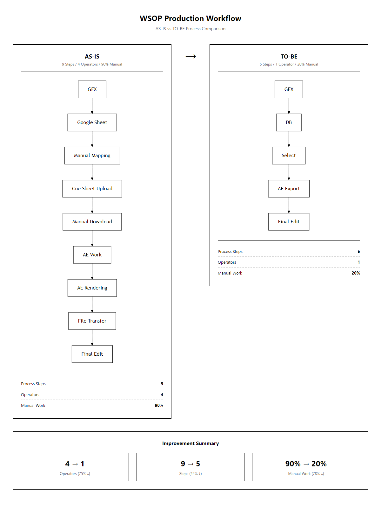
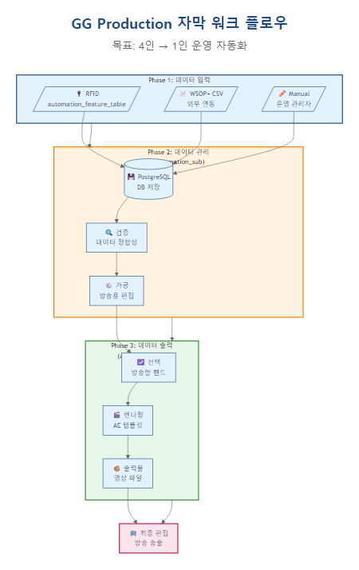
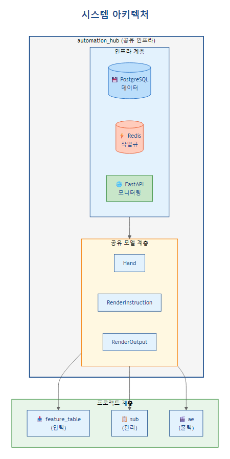
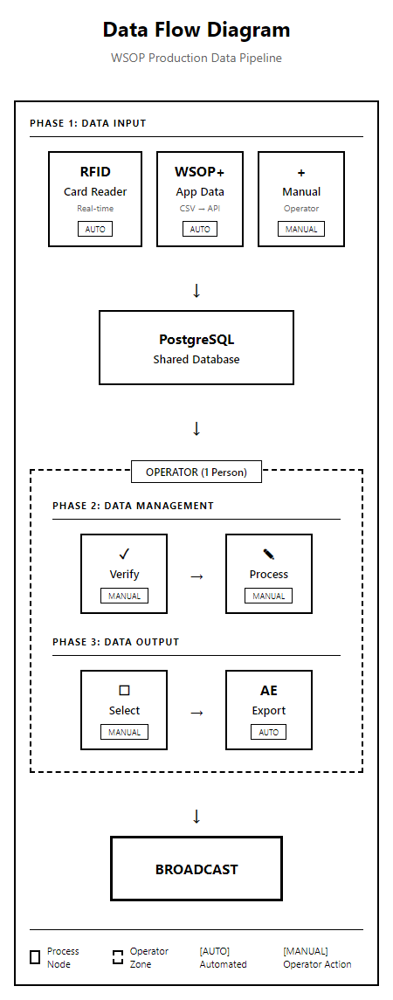
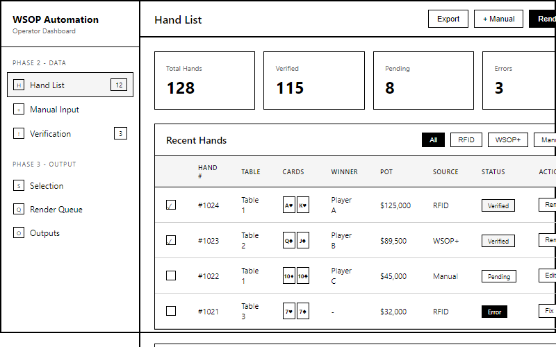
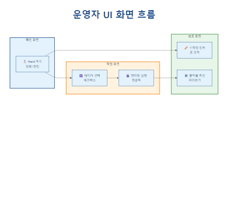

# PRD-0005: GG Production 자막 워크 플로우

| 항목 | 값 |
|------|-----|
| **Version** | 1.0 |
| **Status** | Draft |
| **Priority** | P0 |
| **Created** | 2025-01-08 |
| **Author** | Automation Team |

---

## 1. 개요

### 1.1 목적

WSOP 방송 프로덕션의 **전체 데이터 흐름**을 정의하고, **4인 작업 → 1인 운영** 자동화를 통한 효율화 달성.

### 1.2 핵심 목표

| 지표 | AS-IS | TO-BE |
|------|:-----:|:-----:|
| **운영 인력** | 4명 | **1명** |
| **프로세스 단계** | 9단계 | **5단계** |
| **수동 작업** | 90% | **20%** |

### 1.3 인력 효율화

| 역할 | AS-IS | TO-BE |
|------|:-----:|:-----:|
| 자막 작업 | 2명 | - |
| 편집/렌더링/출력 | 2명 | - |
| **운영 관리자** | - | **1명** |
| **합계** | **4명** | **1명** |

---

## 2. 프로세스 비교

### 2.1 AS-IS (기존 방식)

```
GFX → 구글 시트 → 수동 매핑 → 큐시트 업로드 → 수동 다운로드 → AE 작업 → AE 렌더링 → 파일 전달 → 최종 편집
```

**9단계 수동 프로세스**:

| 단계 | 작업 | 담당 | 문제점 |
|:----:|------|------|--------|
| 1 | GFX 데이터 수집 | 자동 | - |
| 2 | 구글 시트 입력 | 수동 | 오타, 누락 |
| 3 | 수동 매핑 | 수동 | 시간 소요 |
| 4 | 큐시트 업로드 | 수동 | 형식 오류 |
| 5 | 수동 다운로드 | 수동 | 버전 혼란 |
| 6 | AE 작업 | 수동 | 반복 작업 |
| 7 | AE 렌더링 | 반자동 | 대기 시간 |
| 8 | 파일 전달 | 수동 | 경로 오류 |
| 9 | 최종 편집 | 수동 | - |

### 2.2 TO-BE (자동화)

```
GFX → DB → Select → AE Export → Final Edit
```

**5단계 자동화 프로세스**:

| 단계 | 작업 | 담당 | 개선점 |
|:----:|------|------|--------|
| 1 | GFX 데이터 수집 | 자동 | RFID + WSOP+ |
| 2 | DB 저장/구조화 | 자동 | 실시간 동기화 |
| 3 | 데이터 선택 | **운영 관리자** | UI 기반 선택 |
| 4 | AE Export | 자동 | 원클릭 렌더링 |
| 5 | Final Edit | **운영 관리자** | 최종 확인 |



---

## 3. 프로덕션 워크플로우

### 3.1 전체 흐름



### 3.2 Phase별 상세

#### Phase 1: 데이터 입력

| 소스 | 형태 | 처리 | 프로젝트 |
|------|------|------|----------|
| **RFID** | 실시간 | 자동 | automation_feature_table |
| **WSOP+** | CSV → API | 자동 | 외부 연동 |
| **Manual** | 수작업 | 운영 관리자 | automation_sub UI |

#### Phase 2: 데이터 관리 (automation_sub)

| 기능 | 설명 | 담당 |
|------|------|------|
| DB 저장 | 원시 데이터 구조화 | 자동 |
| 검증 | 데이터 정합성 확인 | 운영 관리자 |
| 가공 | 방송용 데이터 편집 | 운영 관리자 |
| 수작업 입력 | 누락 데이터 보정 | 운영 관리자 |

#### Phase 3: 데이터 출력 (automation_ae)

| 기능 | 설명 | 담당 |
|------|------|------|
| 데이터 선택 | 방송할 핸드 선택 | 운영 관리자 |
| 렌더링 실행 | AE 템플릿 적용 | 자동 |
| 출력물 생성 | 영상 파일 생성 | 자동 |
| 최종 확인 | 품질 검수 | 운영 관리자 |

---

## 4. 시스템 아키텍처

### 4.1 프로젝트 구조



### 4.2 프로젝트별 역할

| 프로젝트 | Phase | 역할 | 핵심 기능 |
|----------|:-----:|------|-----------|
| **automation_feature_table** | 1 | 데이터 입력 | RFID 카드 인식, Hand 데이터 생성 |
| **automation_sub** | 2 | 데이터 관리 | DB 구조화, 운영자 UI, 검증/가공 |
| **automation_ae** | 3 | 데이터 출력 | AE 렌더링, 출력물 생성 |
| **automation_hub** | 전체 | 공유 인프라 | DB, 모델, Repository, 모니터링 |

### 4.3 데이터 흐름



---

## 5. 운영자 UI

### 5.1 운영 관리자 대시보드

운영 관리자가 Phase 2 + Phase 3를 단일 UI에서 처리:

| 화면 | 기능 | Phase |
|------|------|:-----:|
| **Hand 목록** | 입력된 Hand 데이터 확인/편집 | 2 |
| **수작업 입력** | Manual 데이터 입력 폼 | 1 |
| **데이터 검증** | 오류/누락 데이터 표시 | 2 |
| **렌더링 선택** | 방송할 Hand 선택 | 3 |
| **렌더링 큐** | 진행 중인 렌더링 상태 | 3 |
| **출력물 확인** | 완료된 렌더링 결과 | 3 |



### 5.2 화면 흐름



---

## 6. 시각화 산출물

### 6.1 HTML 목업

| 파일명 | 내용 |
|--------|------|
| `prd-0005-as-is-to-be.html` | AS-IS vs TO-BE 프로세스 비교 |
| `prd-0005-workflow.html` | 전체 워크플로우 (Phase 1-3) |
| `prd-0005-architecture.html` | 시스템 아키텍처 |
| `prd-0005-data-flow.html` | 데이터 흐름도 |
| `prd-0005-screen-flow.html` | 화면 흐름 |
| `prd-0005-operator-dashboard.html` | 운영자 대시보드 UI 목업 |

### 6.2 스크린샷

| 파일명 | 위치 |
|--------|------|
| `prd-0005-as-is-to-be.png` | `docs/images/` |
| `prd-0005-workflow.png` | `docs/images/` |
| `prd-0005-architecture.png` | `docs/images/` |
| `prd-0005-data-flow.png` | `docs/images/` |
| `prd-0005-screen-flow.png` | `docs/images/` |
| `prd-0005-operator-dashboard.png` | `docs/images/` |

---

## 7. 연관 PRD

| PRD | 제목 | 관계 |
|-----|------|------|
| PRD-0001 | Automation Hub v2.0 | 기술 인프라 |
| PRD-0002 | 충돌/중복 모니터링 | 데이터 품질 |
| PRD-0003 | 모델 통합 | 데이터 구조 |
| PRD-0004 | 프론트엔드 대시보드 | 운영자 UI |

---

## 8. 용어 정의

| 용어 | 설명 |
|------|------|
| **GFX** | Graphics, 방송 그래픽 데이터 |
| **RFID** | Radio-Frequency Identification, 카드 인식 기술 |
| **WSOP+** | World Series of Poker Plus 앱 |
| **Hand** | 포커 한 판의 데이터 (카드, 액션, 결과) |
| **AE** | Adobe After Effects, 렌더링 소프트웨어 |
| **운영 관리자** | Phase 2+3를 담당하는 1인 운영자 |

---

## Appendix

### A. 참조 문서

- [automation_feature_table README](../../../automation_feature_table/README.md)
- [automation_sub README](../../../automation_sub/README.md)
- [automation_ae README](../../../automation_ae/README.md)

### B. 변경 이력

| 버전 | 날짜 | 변경 내용 |
|------|------|-----------|
| 1.0 | 2025-01-08 | 초안 작성 |
